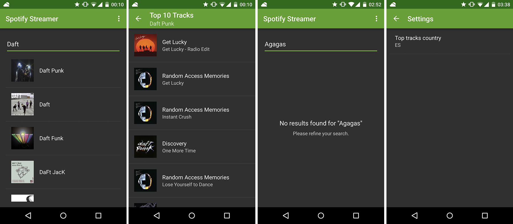

# nanodegree_spotify_streamer_stage1
First stage of the Spotify Streamer project.

## Author
[Ferran Negre Pizarro](https://profiles.udacity.com/u/ferrannegre)

## Screenshots

## Comments to the reviewer
- Used a NetworkFragment (retained non UI fragment) based on Udacity [Lesson 5: Fragments with no UI](https://www.udacity.com/course/viewer#!/c-ud853-nd/l-1623168625/m-1667758616)
	- This fragment makes all the calls using the Spotify API and saves the results
- Destroying the activity (ex: rotation) keeps the results (on NetworkFragment) and also it doesn’t trigger an extra HTTP call
- If no results (both Artist or Top Tracks) it shows in the layout a message asking to the user to refine the search or an error message (if there is one)
- I created a SettingsActivity for the country code
- Min SDK = 7
	- Using Fragment from the Support Library
	- adapter.add (Gingerbread) and addAll for the rest
	- Workaround for having a material toolbar in the SettingsActivity
